# Sakura Cards


## Incluir CSS

De forma directa css se puede incluir con la etiqueta `<style>` de dos formas:

1. En cada una de las etiquetas se le aplican sus estilos.

   ```html
   <h1 style="color:blue; font-size:14px;">Título azul</h1>
   <h1 style="color:red; font-size:16px;">Título rojo</h1>
   ```

2. Al principio del documento en `<head>`.

   ```html
   <!DOCTYPE html>
   <html>
     <head>
       <style>
         h1 {
           color: blue;
           font-size: 14px;
         }
       </style>
     </head>
     <body>
       <h1>Título azul</h1>
     </body>
   </html>
   ```

En ambos casos la reutilización del código es limitada, en el primer caso para solo un `<h1>` y en el segundo solo para los de la misma página. Por esto lo más recomendable es integrar css mediante la etiqueta `<link>` en el `<head>` del documento, siendo el código css universal para todas las página en las que lo usemos.

```html
<head>
  <link rel="stylesheet" href="/src/assets/sass/main.scss" />
</head>
```

## Metodología BEM

Para facilitar la lectura y entendimiento del código usamos la metodologia BEM (Block Element Modifier). El CSS será estucturado nombrando cada clase por el bloque en el que está, el elemento y, si fuera el caso, los modificadores. Así al mirar a un elemento sabremos directamente todos esos datos y podremos aprovechar el código.
Además junto a SCSS podemos simplificar aún más con formaciones como esta:

```scss
.header {
  //Propiedades del header
  &__btn {
    //Propiedades de botones del header (header__btn)
    &_access {
      /*
      Propiedades de botones access en el header 
      (header__btn_access)
      */
    }
  }
}
```

## Cambios en el diseño vs prototipado

- Intercambio de colores principal y secundario en modo noche para mejorar la visibilidad.
- La desaparición de las flechas en el footer del listado viene dado por la falta de necesidad de esta. El listado no es tan largo como para necesitar varias páginas.
- Añadido de una página secreta para cumplir el RA3e de video al pulsar ¿? en la página 404.
- Añadido de sombra en algunos botones que faltaban.
- Añadida una sombra por encima del footer para diferenciarlo mejor en las páginas de formulario y darle profundidad.

### Página de inicio

- Añadido de música de fondo para cumplir el RA3e de audio.

### Flujo de registro, Acceso del usuario y Contacto

- Cambio de localización de los botones sociales para aumentar la cohesión del formulario.
- Bordes añadidos a los campos para mejorar la visibilidad.

### Página de perfil de usuario

- Cambio en el color de la línea para que se distinga mejor.

### Listado de productos

- La cantidad de cartas por fila depende del flex, por lo que es variable.
- Añadido el nombre de cada carta en español debajo para facilitar su lectura.

### Vista de producto

- Cambio de los botones de alas por números.
- Ajuste de separaciones.
- Cambio de color de las letras para mejorar visibilidad.

## Validación de código css


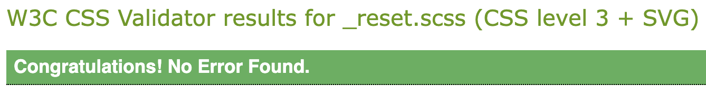
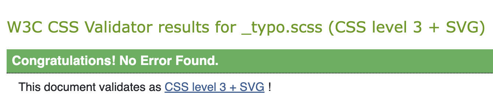
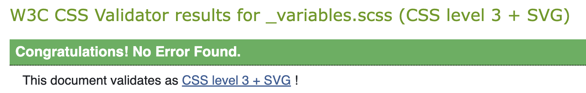
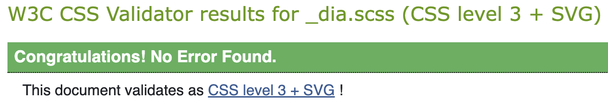
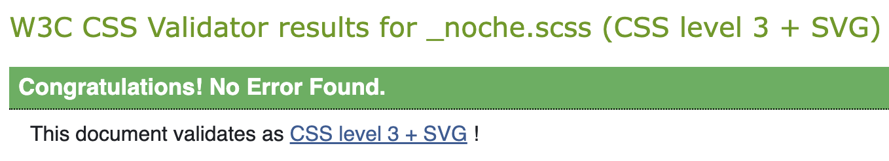
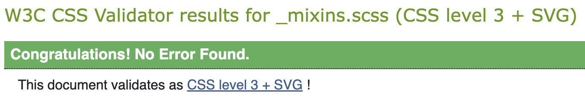

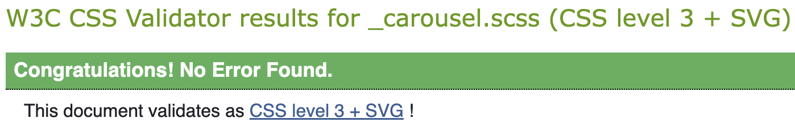
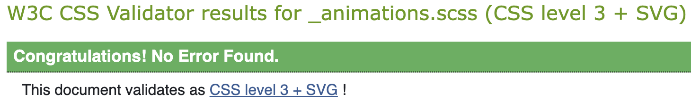
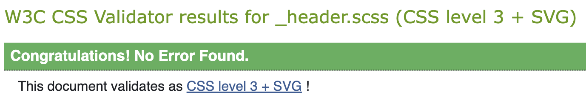
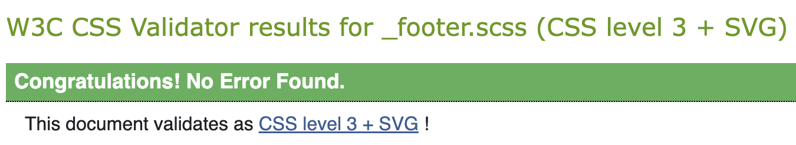
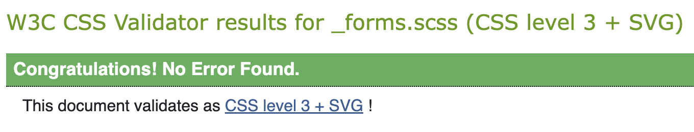
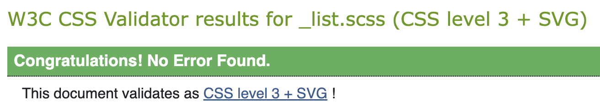
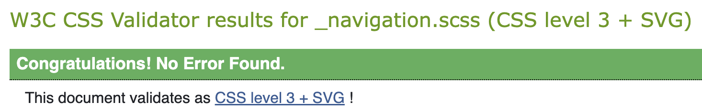
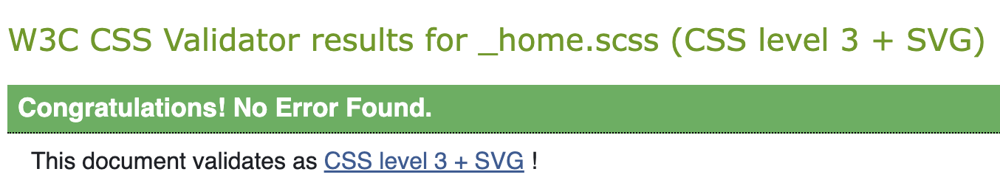
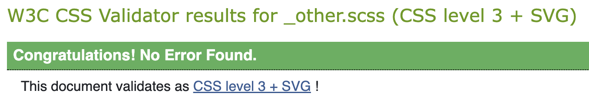
